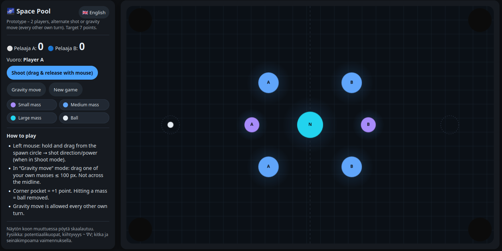

## Space Pool (Avaruusbiljardi)

Space Pool is a two-player browser prototype where gravity wells replace classic pool balls. Players alternate turns from the short ends of the table: either shoot a ball from your spawn circle or perform a limited gravity move to reposition one of your own masses. The board scales responsively, and the physics is a lightweight canvas simulation with potential wells, friction, and damped wall bounces.

### Features
- Gravity-well gameplay on HTML5 Canvas
- Alternating turns: Shoot or do a gravity move
- Bonus move on opponent-mass hit (move one own mass up to 3× its diameter)
- Per-player miss counters; game ends when both players have ≥ 3 misses
- Corner pockets for points; masses can capture the ball
- Internationalization (Finnish and English) with a language dropdown

### How to Play
- Shoot: Drag from your spawn circle (left/right center) to set direction and power, then release.
- Gravity move: Drag one of your own masses up to its limit; you cannot cross the vertical midline.

Scoring and rules:
- Pocketing the ball = +1 point to the striker.
- Hitting an opponent’s mass = +1 point to the striker and grants a one-time bonus gravity move (3× diameter).
- Hitting your own mass = −1 point to the striker.
- Hitting the neutral center mass = no score change.
- Miss counters: If a shot ends without hitting any opponent mass, the striker’s miss counter increases by 1. When anyone hits an opponent mass, both miss counters reset to 0. The game ends when both players have at least 3 misses.

### Internationalization
- Translations live in `js/i18n.js` (Finnish `fi`, English `en`).
- Default language follows the browser/system setting and is persisted to local storage.
- Language can be switched via the dropdown in the header.

### Run Locally
- No build required. Open `index.html` in a modern browser.

Project structure:
- `index.html` – UI shell
- `css/style.css` – styles
- `js/main.js` – gameplay and rendering
- `js/i18n.js` – translations and language switching

### Tech Notes
- Canvas 2D rendering; simple integrator with friction and wall damping
- Web Audio API for sound effects
- Responsive layout with `ResizeObserver`

### License
MIT (unless otherwise noted).

